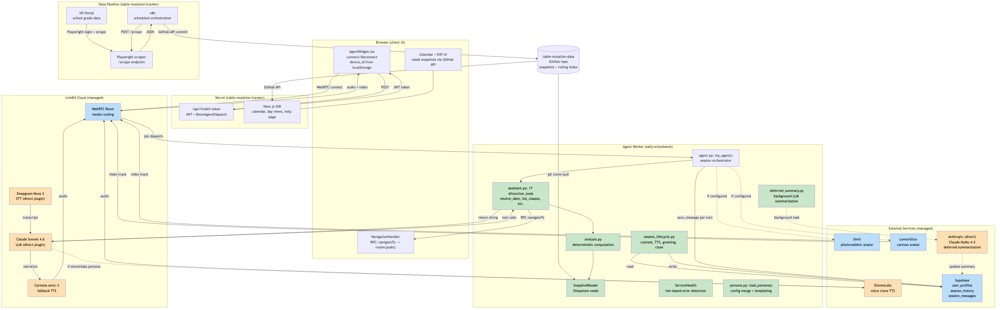
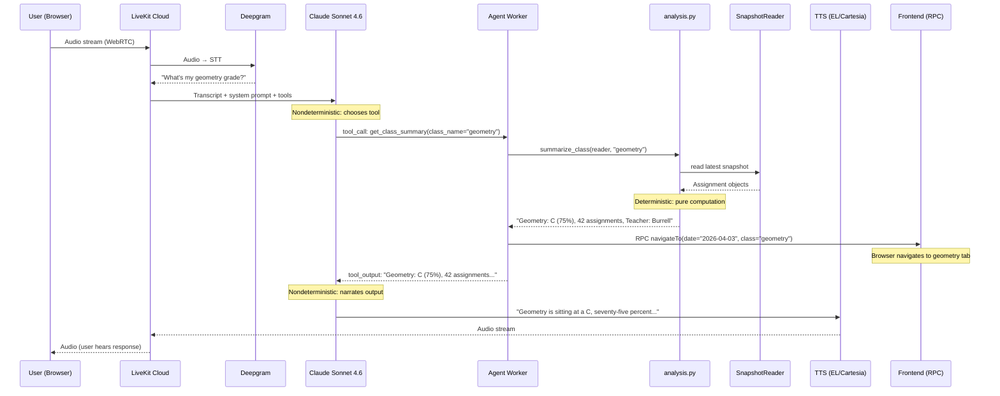
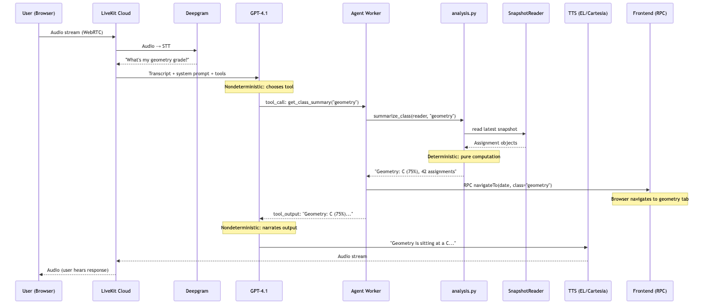
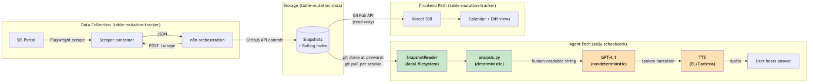

# Architecture Deep-Dive

How the system works: what executes where, what is deterministic vs. nondeterministic, and how the three repos interact. This is an internal reference for debugging and understanding, not a public-facing doc.

## System Overview

```mermaid
flowchart TB
    subgraph Browser["Browser (client JS)"]
        Widget["AgentWidget.tsx\nconnect/disconnect\ndevice_id from localStorage"]
        NavHandler["NavigationHandler\nRPC: navigateTo → router.push()"]
        CalUI["Calendar + Diff UI\nreads snapshots via GitHub API"]
    end

    subgraph Vercel["Vercel (table-mutation-tracker)"]
        TokenAPI["/api/livekit-token\nJWT + RoomAgentDispatch"]
        NextSSR["Next.js SSR\ncalendar, day views, help page"]
    end

    subgraph LK["LiveKit Cloud (managed)"]
        Room["WebRTC Room\nmedia routing"]
        STT["Deepgram Nova 3\nSTT via inference gateway"]
        LLM["Claude Sonnet 4.6\nLLM via inference gateway"]
        TTS_LK["Cartesia sonic-3\ndefault TTS"]
    end

    subgraph Agent["Agent Worker (sally-schoolwork)"]
        MyAgent["agent.py: my_agent()\nsession orchestrator"]
        Tools["assistant.py: 17 @function_tools\nresolve_date, list_classes, etc."]
        Analysis["analysis.py\ndeterministic computation"]
        Reader["SnapshotReader\nfilesystem reads"]
        Health["ServiceHealth\ntier-based error detection"]
        Persona["persona.py: load_persona()\nconfig merge + templating"]
        Lifecycle["session_lifecycle.py\ncontext, TTS, greeting, close"]
        DeferredSum["deferred_summary.py\nbackground LLM summarization"]
    end

    subgraph External["External Services (managed)"]
        EL["ElevenLabs\nvoice clone TTS"]
        Hedra["Hedra\nphotorealistic avatar"]
        Lemon["LemonSlice\ncartoon avatar"]
        Supa["Supabase\nuser_profiles\nsession_history\nsession_messages"]
        Anth["Anthropic (direct)\nClaude Haiku 4.5\ndeferred summarization"]
    end

    subgraph Upstream["Data Pipeline (table-mutation-tracker)"]
        n8n["n8n\nscheduled orchestration"]
        Scraper["Playwright scraper\n/scrape endpoint"]
        SIS["SIS Portal\nschool grade data"]
    end

    DataRepo[("table-mutation-data\nGitHub repo\nsnapshots + rolling index")]

    %% Data pipeline
    SIS -->|"Playwright login + scrape"| Scraper
    n8n -->|"POST /scrape"| Scraper
    Scraper -->|"JSON"| n8n
    n8n -->|"GitHub API commit"| DataRepo

    %% Agent reads data
    DataRepo -->|"git clone/pull"| Reader

    %% Frontend reads data
    DataRepo -->|"GitHub API"| NextSSR

    %% Browser ↔ Vercel
    Widget -->|"POST"| TokenAPI
    TokenAPI -->|"JWT token"| Widget
    CalUI --- NextSSR

    %% Browser ↔ LiveKit
    Widget -->|"WebRTC connect"| Room

    %% Agent ↔ LiveKit
    Room -->|"job dispatch"| MyAgent
    MyAgent --> Tools
    Tools --> Analysis
    Analysis --> Reader
    Tools -->|"return string"| LLM
    STT -->|"transcript"| LLM
    LLM -->|"tool calls"| Tools
    LLM -->|"narration"| TTS_LK
    LLM -.->|"if elevenlabs persona"| EL
    TTS_LK -->|"audio"| Room
    EL -->|"audio"| Room
    Room -->|"audio + video"| Widget

    %% Avatar
    MyAgent -.->|"if configured"| Hedra
    MyAgent -.->|"if configured"| Lemon
    Hedra -->|"video track"| Room
    Lemon -->|"video track"| Room

    %% RPC navigation
    Tools -->|"RPC navigateTo"| NavHandler

    %% Supabase
    Lifecycle -->|"read"| Supa
    Lifecycle -->|"write"| Supa
    MyAgent -->|"save_message per turn"| Supa

    %% Deferred summarization
    DeferredSum -.->|"background task"| Anth
    Anth -.->|"update summary"| Supa

    %% Styling
    style Analysis fill:#c8e6c9,color:#000
    style Reader fill:#c8e6c9,color:#000
    style Tools fill:#c8e6c9,color:#000
    style Health fill:#c8e6c9,color:#000
    style Persona fill:#c8e6c9,color:#000
    style Lifecycle fill:#c8e6c9,color:#000
    style DeferredSum fill:#c8e6c9,color:#000
    style STT fill:#ffe0b2,color:#000
    style LLM fill:#ffe0b2,color:#000
    style TTS_LK fill:#ffe0b2,color:#000
    style EL fill:#ffe0b2,color:#000
    style Hedra fill:#bbdefb,color:#000
    style Lemon fill:#bbdefb,color:#000
    style Supa fill:#bbdefb,color:#000
    style Anth fill:#ffe0b2,color:#000
    style Room fill:#bbdefb,color:#000
```



**Color key:** Green = deterministic (our code, tested). Orange = nondeterministic (LLM, STT, TTS). Blue = external managed service.



## Request Flow

What happens when a user says "What's my geometry grade?"





**Key insight:** The deterministic boundary is between the agent worker and Claude Sonnet 4.6. Everything inside the agent (tool dispatch, analysis, snapshot reading) is tested and predictable. The LLM layer on both sides (tool selection, narration) is nondeterministic.

## Runtime Boundaries

| Runtime | Process | Repo | What runs there |
|---------|---------|------|----------------|
| **LiveKit Cloud** | Room server | (managed) | WebRTC room, media routing, agent dispatch. STT/LLM/TTS now use direct provider plugins (not inference gateway). |
| **Deepgram** | STT service | (managed) | Speech-to-text via LiveKit inference gateway. Rate-limited (429s on rapid reconnects). |
| **Anthropic** | LLM service | (managed) | Claude Sonnet 4.6 for agent conversation (direct plugin). Claude Haiku 4.5 for deferred summarization (direct AsyncAnthropic call). |
| **ElevenLabs** | TTS service | (managed) | Voice cloning + TTS when persona uses `tts_provider: "elevenlabs"`. Voice settings (stability, similarity, speed) in persona config. |
| **Cartesia** | TTS service | (managed) | Default TTS via LiveKit inference gateway. Used when no ElevenLabs voice ID configured. |
| **Agent worker** | Python (`agent.py start`) | sally-schoolwork | `my_agent()`, 17 `@function_tool` methods, `ServiceHealth`, persona loading, Supabase calls, git pull, close handler. |
| **Hedra** | Avatar service | (managed) | Photorealistic lip-synced video from headshot (512x512). Published as LiveKit video track. |
| **LemonSlice** | Avatar service | (managed) | Cartoon/stylized avatar (368x560). Published as LiveKit video track. |
| **Supabase** | Hosted Postgres | (managed) | `user_profiles`, `session_history`, `session_messages` tables. |
| **GitHub** | Git repo | table-mutation-data | Snapshot JSON files, rolling index. Written by n8n pipeline. Cloned by agent at prewarm, pulled per session. |
| **Vercel** | Next.js SSR | table-mutation-tracker | Calendar UI, diff views, AgentWidget, NavigationHandler, `/api/livekit-token`. |
| **Browser** | Client JS | table-mutation-tracker | LiveKit React SDK, WebRTC media, RPC handler, localStorage device_id. |
| **n8n** | Orchestration | table-mutation-tracker (config) | Scheduled SIS scraping, snapshot commits, rolling index rebuild. Upstream of agent. |
| **Container runtime** | Playwright scraper | table-mutation-tracker | `/scrape` and `/rebuild-index` endpoints. Stateless workers called by n8n. |

## Deterministic vs. Nondeterministic

### Deterministic (green) — our code, unit tested

| Component | What it does | Test file |
|-----------|-------------|-----------|
| `resolve_relative_date()` | Date math from natural language | test_navigation.py |
| `analysis.py` (17 functions) | Summarize, diff, trend, flag, ungraded | test_analysis.py |
| `format_assignment()`, `_format_changes()` | String formatting for tool output | test_navigation.py |
| `SnapshotReader` | Filesystem reads, slug resolution | test_analysis.py |
| `save_session_history()` | Session summary from messages, dynamic class keywords | (integration) |
| `is_placeholder_summary()` | Regex detection of placeholder summaries | test_navigation.py |
| `ServiceHealth` | Error detection, tier classification, gating | test_service_health.py |
| `load_persona()` | Config merge, markdown concatenation, templating | (integration) |
| `build_user_context()` | Profile fetch, session history, onboarding flag | (integration) |
| `build_data_context()` | Class overview, date annotation | (integration) |
| `configure_tts()` | TTS provider selection from persona config | (integration) |

### Nondeterministic (orange) — LLM, STT, TTS, external APIs

| Component | What varies | Controlled by | Failure mode |
|-----------|------------|---------------|-------------|
| **Claude Sonnet 4.6 tool selection** | Which tool it calls for a user question | System prompt + tool descriptions | Wrong tool, no tool, hallucinated args |
| **Claude Sonnet 4.6 narration** | Wording, tone, length, format of spoken response | base.md WRONG/RIGHT examples | Bullets, emojis, verbosity, markdown |
| **Onboarding flow** | Whether LLM asks 1 question per turn | base.md CRITICAL RULE | Batches Q2+Q3, adds Q4, skips show_capabilities |
| **Guardrail compliance** | Whether LLM redirects out-of-scope questions | base.md guardrails section | Lectures instead of redirecting |
| **Deepgram STT** | Transcription accuracy | Audio quality, accent | Mishears ("Dave" → "Dev"), 429 rate limit |
| **ElevenLabs TTS** | Prosody, pacing, voice fidelity | Voice settings in persona config | Auth failure, rate limit, invalid voice ID |
| **Cartesia TTS** | Audio rendering | LiveKit inference gateway | Less variable but still nondeterministic |
| **Hedra avatar** | Lip-sync quality, video rendering | Headshot quality | 500 errors (intermittent, gracefully handled) |
| **LemonSlice avatar** | Animation quality | Image URL, agent_prompt | Credit exhaustion, API errors |
| **Deferred summarization** | LLM-generated session summary text | Transcript content | Background task, may fail silently |

### The boundary

```
User speaks
    ↓ [NONDETERMINISTIC: Deepgram STT]
Transcript text
    ↓ [NONDETERMINISTIC: Claude Sonnet 4.6 tool selection]
Tool call with args
    ↓ [DETERMINISTIC: Python @function_tool → analysis.py]
Human-readable result string
    ↓ [NONDETERMINISTIC: Claude Sonnet 4.6 narration]
Spoken response text
    ↓ [NONDETERMINISTIC: TTS rendering]
Audio to user
```

**The LLM is a thin nondeterministic layer sandwiched between deterministic inputs and outputs.** If data is wrong, look at analysis.py. If phrasing is wrong, look at base.md instructions. If the wrong tool was called, look at tool descriptions.

## What the LLM Controls vs. What Code Controls

**LLM controls:**
- Which tool to call (from user intent + tool descriptions)
- How to narrate tool output (wording, tone, sentence structure)
- Whether to follow persona instructions (onboarding, guardrails, no-bullet rules)

**Code controls:**
- What data the tool returns (`analysis.py`, `snapshot_reader`)
- When the browser navigates (tool methods call `_navigate_browser`)
- What context the LLM sees (persona instructions + `context_parts` injected at session start)
- Whether the session starts at all (`ServiceHealth` gating)
- What gets persisted (Supabase writes in event handlers and close handler)
- The greeting text (hardcoded `session.say()` with name interpolation)
- Session summary keyword extraction (dynamic from rolling index, not LLM)

## Failure Modes

Real failures from 2026-04-04/05 testing sessions, mapped to components:

| Failure | Component | Symptom | ServiceHealth tier | Detection |
|---------|-----------|---------|-------------------|-----------|
| Deepgram 429 | STT (managed) | Greeting starts, agent goes silent, session killed after 3 retries | CRITICAL (framework-level) | Agent logs: `"AgentSession is closing due to unrecoverable error: 429"` |
| LemonSlice credits exhausted | Avatar (managed) | No video track, agent continues voice-only | OPTIONAL | `health.check_service("avatar", ...)` logs failure |
| Orphaned multiprocessing workers | Agent worker (local) | New agent shows no logs, old worker handles sessions with stale code | N/A (process management) | `ps aux \| grep multiprocessing` |
| OpenAI STT incompatible with MultilingualModel | STT config (code) | Greeting plays, voice transcribed but turn detection never triggers | CRITICAL | Required live session to diagnose; no programmatic detection |
| Supabase unreachable | Supabase (managed) | No profile loaded, no session history, no onboarding | IMPORTANT | `health.check_service_sync("supabase", ...)` returns None |
| Git pull timeout | GitHub (managed) | Agent uses stale snapshot data | IMPORTANT | `health.check_service_sync("git", reader.refresh)` logs timeout |
| Hedra 500 | Avatar (managed) | No video, falls back to BarVisualizer | OPTIONAL | `health.check_service("avatar", ...)` logs failure |

## Data Lifecycle

```mermaid
flowchart LR
    subgraph Collection["Data Collection (table-mutation-tracker)"]
        SIS["SIS Portal"] -->|"Playwright scrape"| Scraper["Scraper container"]
        n8n["n8n orchestration"] -->|"POST /scrape"| Scraper
        Scraper -->|"JSON"| n8n
    end

    subgraph Storage["Storage (table-mutation-data)"]
        n8n -->|"GitHub API commit"| DataRepo[("Snapshots\n+ Rolling Index")]
    end

    subgraph AgentPath["Agent Path (sally-schoolwork)"]
        DataRepo -->|"git clone at prewarm\ngit pull per session"| Reader["SnapshotReader\n(local filesystem)"]
        Reader --> Analysis["analysis.py\n(deterministic)"]
        Analysis -->|"human-readable string"| LLM["Claude Sonnet 4.6\n(nondeterministic)"]
        LLM -->|"spoken narration"| TTS["TTS\n(EL/Cartesia)"]
        TTS -->|"audio"| User["User hears answer"]
    end

    subgraph FrontendPath["Frontend Path (table-mutation-tracker)"]
        DataRepo -->|"GitHub API\n(read-only)"| Vercel["Vercel SSR"]
        Vercel --> CalUI["Calendar + Diff views"]
    end

    style Analysis fill:#c8e6c9,color:#000
    style Reader fill:#c8e6c9,color:#000
    style LLM fill:#ffe0b2,color:#000
    style TTS fill:#ffe0b2,color:#000
```





**Two paths to the same data:** The agent reads via local git clone (fast, filesystem I/O). The frontend reads via GitHub API (SSR on Vercel). They never share data with each other — only navigation commands (RPC).

## Persona Config Architecture

### Current design: split config with gitignore boundary

Persona configuration is split across committed and gitignored files, with the git boundary drawn at PII/secrets:

```
personas/
  config.json            ← Committed. Provider choices, temperature, greetings.
  config.local.json      ← Gitignored. Real names, service IDs, voice/avatar IDs.
  base.md                ← Committed. Shared instructions, onboarding, guardrails.
  example/persona.md     ← Committed. Template for new personas.
  <name>/persona.md      ← Committed. Per-persona personality, catchphrases.
```

`load_persona()` in `persona.py` merges both configs at runtime, with env var fallbacks for deployment (where `config.local.json` doesn't exist).

### What goes where

| Data | File | Why |
|------|------|-----|
| `avatar_provider: "hedra"` | config.json | Architecture choice, no secret |
| `hedra_avatar_id: "710b89..."` | config.local.json | Service-specific ID, tied to personal account |
| `tts_provider: "elevenlabs"` | config.json | Architecture choice |
| `elevenlabs_voice_id: "UzmY..."` | config.local.json | Cloned voice ID, personal asset |
| `elevenlabs_speed: 0.85` | config.local.json | Tuned to specific voice clone |
| `llm_temperature: 0.4` | config.json | Model behavior, not personal |
| `greeting: "Hey hey!"` | config.json | Character design, not PII |
| `student_name: "Jackson"` | config.local.json | Real person's name |
| Personality, catchphrases | persona.md | Character design, not PII |
| Onboarding script, guardrails | base.md | Shared behavior rules |

### Design rationale

The split exists because this is a public repo with private data:

1. **Public repo, private student.** The codebase is on public GitHub. Student name, school name, teacher names, and service account IDs must not be committed.
2. **Persona design is public, persona identity is private.** The *character* of Sally Schoolwork (catchphrases, voice style, guardrails) is shareable. The *voice clone ID* and *avatar image* are personal assets.
3. **Deployment uses env vars, not local files.** When deployed to LiveKit Cloud, `config.local.json` doesn't exist. `load_persona()` falls back to env vars (`ELEVENLABS_VOICE_ID`, `HEDRA_AVATAR_ID`, etc.) set as Cloud secrets.

### Considered alternatives

**A. Single `config.json` with secrets in env vars only (no `config.local.json`).**
Rejected because local development requires too many env vars. `config.local.json` is a convenience layer for dev that mirrors what env vars provide in production.

**B. Per-persona local config in subdirectories (`personas/<name>/config.local.json`).**
Would eliminate the single `config.local.json` and co-locate persona config with persona instructions. Cleaner for many personas. Not done because there are only 3 personas and the current approach works. Worth revisiting if persona count grows.

**C. Merge everything into `config.json` and gitignore service IDs via `.gitignore` patterns.**
Rejected because gitignore operates on files, not fields. Can't gitignore a JSON key.

**D. Encrypt secrets in committed config (SOPS, age, etc.).**
Overengineered for a 4-user project. Would add tooling dependency for every contributor.

### Known friction

- Adding a persona requires editing two files (`config.json` + `config.local.json`) plus creating a subdirectory with `persona.md`.
- `load_persona()` has a 3-layer merge: `config.json` → `config.local.json` → env vars. Complex but documented.
- Voice settings (`elevenlabs_speed`, etc.) are in `config.local.json` because they're tuned to specific voice clones. If you change the voice, the settings may need retuning. This coupling is implicit.

## Cross-Repo Dependencies

```
table-mutation-tracker (frontend + scraper)
  ├── Scraper writes to → table-mutation-data (via n8n + GitHub API)
  ├── Frontend reads from → table-mutation-data (via GitHub API)
  ├── Frontend connects to → sally-schoolwork agent (via LiveKit Cloud)
  └── Frontend receives RPC from → sally-schoolwork agent (navigateTo)

sally-schoolwork (agent)
  ├── Reads from → table-mutation-data (local git clone)
  ├── Writes to → Supabase (profiles, sessions, messages)
  ├── Sends RPC to → table-mutation-tracker frontend (navigateTo)
  └── Uses → LiveKit Cloud (STT, LLM, TTS, room), Hedra/LemonSlice (avatar),
             ElevenLabs (TTS), Anthropic direct (deferred summarization)

table-mutation-data (data, no code)
  ├── Written by → n8n + scraper (table-mutation-tracker)
  ├── Read by → sally-schoolwork agent (git clone)
  └── Read by → table-mutation-tracker frontend (GitHub API)
```

## Debugging Guide

**"The agent said wrong data"** → `analysis.py` or `snapshot_reader.py`. Deterministic, unit tested. Check the tool's return value.

**"The agent phrased it wrong / used bullets / added emojis"** → `personas/base.md` instructions. LLM instruction-following issue. Check WRONG/RIGHT examples.

**"The agent called the wrong tool"** → Tool descriptions in `@function_tool` docstrings. LLM tool selection issue.

**"The agent didn't respond after greeting"** → Deepgram 429 or STT failure. Check agent logs for `"failed to recognize speech"` or `"AgentSession is closing"`.

**"No avatar video"** → Hedra 500 or LemonSlice credits. Check `health.summary()` in session close log.

**"Browser didn't navigate"** → RPC failure. Check `_navigate_browser` debug log. Frontend may have disconnected.

**"Session history not showing"** → Supabase write failed in close handler, or context injection wording not salient enough. Check `health.summary()` and `session_history` table.

**"No logs in terminal"** → Orphaned multiprocessing workers from prior run. `ps aux | grep multiprocessing`. Or using `dev` instead of `start`.
